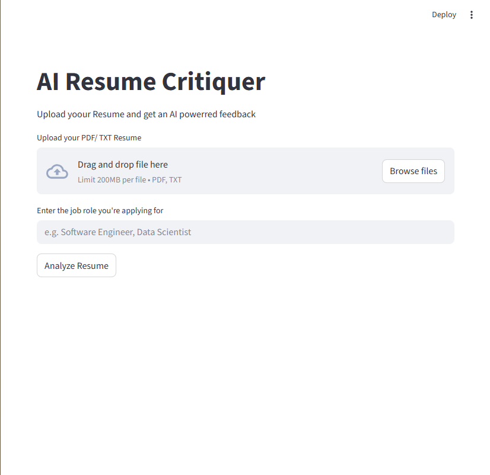

# 🤖 AI Resume Critiquer

An intelligent, Streamlit-powered web app that analyzes uploaded resumes (PDF/TXT) and provides detailed, AI-generated feedback tailored to specific job roles.

This tool helps job seekers refine their resumes by evaluating content quality, skills presentation, and experience descriptions using GPT-based language models.

---

## 🚀 Features

- 📄 Upload resumes in **PDF** or **TXT** format  
- 🧠 Leverages **OpenAI's GPT-3.5-turbo** for intelligent feedback  
- 🎯 Tailored analysis based on the **job role** you provide  
- 🛡 Automatically skips blank files and handles encoding issues  
- 💬 Clear, structured AI feedback in natural language  

---

## 🛠 Tech Stack

| Tool       | Purpose                        |
|------------|--------------------------------|
| Python     | Core programming language      |
| Streamlit  | Web app front-end              |
| OpenAI API | AI-driven feedback generation  |
| PyPDF2     | PDF file reading               |
| dotenv     | Secure environment variables   |

---

## 📦 Installation

```bash
# 1. Clone the repo
git clone https://github.com/your-username/AI-Resume-Critiquer.git
cd AI-Resume-Critiquer

# 2. Create virtual environment
python -m venv .venv
source .venv/Scripts/activate  # or `source .venv/bin/activate` on macOS/Linux

# 3. Install dependencies
pip install -r requirements.txt
```

---

## 🔐 Setup OpenAI API Key

1. Create a `.env` file in the root directory.  
2. Add your OpenAI key:

```env
OPENAI_API_KEY=sk-XXXXXXXXXXXXXXXXXXXXXXXX
```

✅ Make sure `.env` is included in your `.gitignore` to avoid leaking secrets.

---

## 🚦 Running the App

```bash
streamlit run main.py
```

Then open your browser at:  
**[http://localhost:8501](http://localhost:8501)**

---

## 📂 Project Structure

```
├── main.py              # Main Streamlit app
├── .env                 # Contains your OpenAI key (DO NOT COMMIT)
├── .gitignore           # Ignores .env and other sensitive files
├── requirements.txt     # All required dependencies
└── README.md            # Project documentation
```

---

## 📸 Demo

### 🖼 Static Screenshot


### 🎞 Live Demo (GIF)
> *(Insert demo.gif here once available)*  
You can record your app using tools like [ScreenToGif](https://www.screentogif.com/) or [LICEcap](https://www.cockos.com/licecap/) and save it as `demo.gif`.

---

## 💡 Future Improvements

* ✅ Summary section highlighting key resume strengths  
* 📝 Export AI feedback as PDF  
* 🌐 Multilingual support for global applicants  
* 🔍 ATS (Applicant Tracking System) compatibility check  

---

## 🤝 Contributing

Pull requests are welcome! For major changes, please open an issue first to discuss what you'd like to change.

---

## 📄 License

MIT License — feel free to use, share, and improve.

---

## 🙌 Acknowledgements

* OpenAI for GPT-3.5-turbo  
* Streamlit for rapid app development  
* You, the builder community ❤️

---
